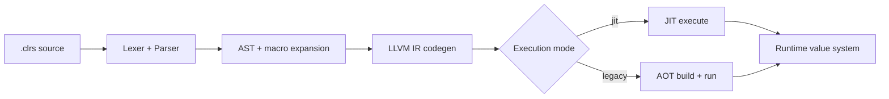

# Compiler & Architecture (Single Source of Truth)

This is the canonical architecture document for Clorus compiler/runtime design.

## Scope

- Frontend/parser model
- Codegen pipeline and execution modes
- Runtime/value model integration
- REPL/run/build execution architecture

## Canonical References

- Architecture baseline: `docs/design/ARCHITECTURE.md`
- Design docs: `docs/design/`
- Runtime internals: `docs/PHASE2_VALUE_SYSTEM.md`

## Current Policy

- This file is the top-level architecture index.
- Structural/compiler behavior changes must be reflected here.
- Deep design notes can stay in `docs/design/`, but this file is the entrypoint.

## Status Snapshot

- Unified JIT-first execution path in progress/completed across run/repl flows.
- Legacy execution path retained for parity validation and confidence testing.

## Pipeline Diagram

Short version: parser is the strict parent, codegen is the ambitious middle child, runtime cleans up everyone’s mess.

## Open Work (Top Level)

- Large-module decomposition (notably oversized codegen modules)
- Continue reducing architecture drift between docs and implementation
- Maintain dual-engine conformance suite coverage (`jit` + `legacy`)
