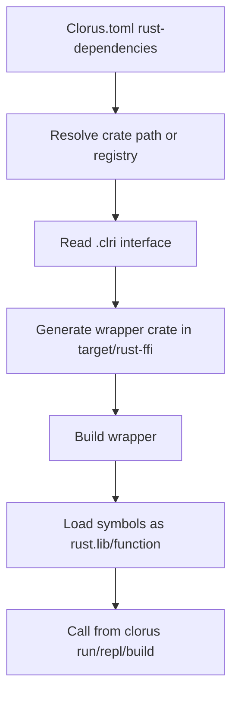

# Rust Interop (Single Source of Truth)

This is the canonical Rust interop document for Clorus.

## Scope

- Rust dependency declaration model (`[rust-dependencies]`)
- Interface model (`.clri`)
- Wrapper generation behavior
- Supported type matrix and current limits

## Canonical References

- Status tracker: `docs/RUST_INTEROP_STATUS.md`
- Existing guide (to be reconciled): `docs/guide/RUST_FFI_GUIDE.md`
- Interop guides: `docs/guides/RUST_INTEROP_GUIDE.md`, `docs/guides/RUST_FFI_QUICKREF.md`

## Current Policy

- `docs/RUST_INTEROP_STATUS.md` is normative for implementation status.
- This file is the product-facing entrypoint for interop decisions.
- Legacy/stale phase language in older docs should be treated as non-authoritative.

## Status Snapshot

- `.clri`-driven interop is the primary path.
- Method/associated-function symbol mapping is supported via `:rust` symbol overrides.
- Numeric primitive matrix has been expanded and validated in wrapper/codegen paths.

## Workflow Diagram

If interop fails, it is usually one of three things: wrong symbol name, unsupported signature, or the crate politely refusing to be FFI-friendly.

## Open Work (Top Level)

- Full end-to-end interop conformance coverage across run/repl/build
- Final docs reconciliation into one clean user-facing flow
- Seamless crate ergonomics improvements beyond current bridge/interface model
