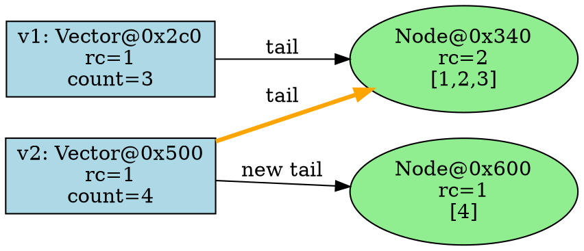

# Clorus Debug Mode & Memory Visualization

## Vision

A comprehensive debugging and visualization system that lets developers:
- See exactly how memory is allocated/deallocated
- Track reference counts in real-time
- Visualize persistent data structure sharing
- Profile performance hotspots
- Understand program execution flow

## CLI Interface

```bash
# Run with debug/metrics enabled
clorus run --debug                    # Basic debug output
clorus run --debug=memory             # Memory tracking only
clorus run --debug=viz                # Visualization mode
clorus run --debug=profile            # Performance profiling
clorus run --debug=all                # Everything

# Output formats
clorus run --debug --format=json      # Machine-readable
clorus run --debug --format=html      # Interactive web view
clorus run --debug --format=text      # Terminal output
clorus run --debug --format=graphviz  # DOT format graphs

# Save to file
clorus run --debug --output=metrics.json
clorus run --debug --output=viz.html
```

## Features

### 1. Memory Tracking

Track every allocation, deallocation, and refcount operation.

#### Output Example (Terminal)
```
🔧 Clorus Debug Mode - Memory Tracking
━━━━━━━━━━━━━━━━━━━━━━━━━━━━━━━━━━━━━━━━━

Compiling hello-world v0.1.0
Running `src/main.clrs`

━━━ Memory Events ━━━

[00.001ms] ALLOC   Vector@0x7f8a2c0  size=48   rc=1   line:1  (def v [1 2 3])
[00.002ms] ALLOC   Node@0x7f8a340    size=256  rc=1   ↳ child of Vector@0x7f8a2c0
[00.003ms] RETAIN  Vector@0x7f8a2c0  rc=1→2            line:2  (def v2 v)
[00.004ms] ALLOC   Vector@0x7f8a500  size=48   rc=1   line:3  (conj v2 4)
[00.004ms] RETAIN  Node@0x7f8a340    rc=1→2            ↳ structural sharing!
[00.005ms] RELEASE Vector@0x7f8a2c0  rc=2→1            line:4  (end of scope)
[00.006ms] RELEASE Vector@0x7f8a2c0  rc=1→0  FREE      ↳ deallocated
[00.006ms] RELEASE Node@0x7f8a340    rc=2→1            ↳ still referenced by v2

━━━ Summary ━━━

Total Allocations:     3
Total Deallocations:   1
Peak Memory Usage:     352 bytes
Current Memory Usage:  304 bytes
Leaked Objects:        0

Live Objects:
  Vector@0x7f8a500  rc=1  size=48   "v2"
  Node@0x7f8a340    rc=1  size=256  (shared by v2)
```

#### JSON Output Format
```json
{
  "session": {
    "start_time": "2024-01-25T18:00:00Z",
    "duration_ms": 6.2,
    "project": "hello-world"
  },
  "memory_events": [
    {
      "timestamp_ms": 0.001,
      "type": "alloc",
      "address": "0x7f8a2c0",
      "object_type": "Vector",
      "size_bytes": 48,
      "refcount": 1,
      "source_location": {
        "file": "src/main.clrs",
        "line": 1,
        "expression": "(def v [1 2 3])"
      }
    },
    {
      "timestamp_ms": 0.003,
      "type": "retain",
      "address": "0x7f8a2c0",
      "refcount_before": 1,
      "refcount_after": 2,
      "source_location": {
        "file": "src/main.clrs",
        "line": 2,
        "expression": "(def v2 v)"
      }
    }
  ],
  "summary": {
    "total_allocations": 3,
    "total_deallocations": 1,
    "peak_memory_bytes": 352,
    "final_memory_bytes": 304,
    "leaked_objects": 0
  },
  "live_objects": [
    {
      "address": "0x7f8a500",
      "type": "Vector",
      "refcount": 1,
      "size_bytes": 48,
      "name": "v2"
    }
  ]
}
```

### 2. Data Structure Visualization

Show how persistent data structures share memory.

#### Terminal Output (ASCII Art)
```
🎨 Vector Visualization
━━━━━━━━━━━━━━━━━━━━━━━━━━━━━━━━━━━━━━━━━

Original:  v1 = [1 2 3]

  Vector@0x7f8a2c0 (rc=1)
  ├─ count: 3
  ├─ shift: 5
  └─ tail: Node@0x7f8a340 (rc=1)
      ├─ [0]: 1.0
      ├─ [1]: 2.0
      └─ [2]: 3.0

After:  v2 = (conj v1 4)

  v1: Vector@0x7f8a2c0 (rc=1)          v2: Vector@0x7f8a500 (rc=1)
  ├─ count: 3                          ├─ count: 4
  └─ tail: Node@0x7f8a340 (rc=2) ──────┼─ tail: Node@0x7f8a340 (SHARED!)
      ├─ [0]: 1.0                      │
      ├─ [1]: 2.0                      └─ new tail: Node@0x7f8a600 (rc=1)
      └─ [2]: 3.0                          └─ [0]: 4.0

Structural Sharing: 256 bytes shared (84% efficiency!)
```

#### HTML Interactive Visualization
```html
<!-- Generate interactive D3.js visualization -->
<!DOCTYPE html>
<html>
<head>
    <title>Clorus Memory Visualization</title>
    <script src="https://d3js.org/d3.v7.min.js"></script>
    <style>
        .vector { fill: #4A90E2; }
        .node { fill: #7ED321; }
        .shared { stroke: #F5A623; stroke-width: 3px; }
        .refcount { font-weight: bold; fill: #D0021B; }
    </style>
</head>
<body>
    <h1>Clorus Memory Visualization</h1>
    <div id="timeline"></div>
    <div id="graph"></div>
    <script>
        // Interactive graph showing memory layout
        // Click on objects to see details
        // Scrub timeline to see evolution
    </script>
</body>
</html>
```

#### Graphviz DOT Format


Save to `.dot` file, then:
```bash
dot -Tpng memory.dot -o memory.png
dot -Tsvg memory.dot -o memory.svg
```

### 3. Reference Count Tracking

Show refcount changes over time.

```
📊 Reference Count Timeline
━━━━━━━━━━━━━━━━━━━━━━━━━━━━━━━━━━━━━━━━━

Vector@0x7f8a2c0:
  0.001ms  ████░░░░░░  rc=1  [ALLOC]
  0.003ms  ████████░░  rc=2  [RETAIN] (def v2 v)
  0.005ms  ████░░░░░░  rc=1  [RELEASE]
  0.006ms  ░░░░░░░░░░  rc=0  [FREE]

Node@0x7f8a340:
  0.002ms  ████░░░░░░  rc=1  [ALLOC]
  0.004ms  ████████░░  rc=2  [RETAIN] (shared by v2)
  0.007ms  ████░░░░░░  rc=1  [RELEASE] (v1 freed)
  ...      ████░░░░░░  rc=1  [ALIVE] (still used by v2)
```

### 4. Performance Profiling

Track execution time and hotspots.

```
⚡ Performance Profile
━━━━━━━━━━━━━━━━━━━━━━━━━━━━━━━━━━━━━━━━━

Function                  Calls    Total Time    Avg Time    %Total
────────────────────────────────────────────────────────────────────
clorus_vector_conj        1000     2.45ms        2.45μs      68%
clorus_vector_nth         5000     0.85ms        0.17μs      24%
clorus_hashmap_assoc      100      0.25ms        2.50μs      7%
clorus_release            2500     0.05ms        0.02μs      1%
────────────────────────────────────────────────────────────────────
TOTAL                              3.60ms

Memory Operations:
  Allocations:     1100 (305μs avg)
  Deallocations:   1050 (28μs avg)
  Retains:         2500 (12μs avg)
  Releases:        2500 (20μs avg)

Hotspots:
  🔥 Line 15: (vector_conj v i)  - called 1000 times
  🔥 Line 22: (nth v i)          - called 5000 times
```

### 5. Leak Detection

Automatically detect memory leaks.

```
🔍 Memory Leak Detection
━━━━━━━━━━━━━━━━━━━━━━━━━━━━━━━━━━━━━━━━━

⚠️  WARNING: Potential memory leak detected!

Leaked Objects:

  Vector@0x7f8a800  rc=1  size=48   allocated at line:10
    ↳ Not reachable from any variable
    ↳ Allocated in: (def temp-vec [1 2 3])
    ↳ Never released

  Node@0x7f8a900  rc=2  size=256  allocated at line:10
    ↳ Part of cycle?
    ↳ Held by: Vector@0x7f8a800, Vector@0x7f8ab00

Suggestions:
  - Check for unreleased variables
  - Look for circular references
  - Use weak references for cycles

Total Leaked Memory: 304 bytes
```

### 6. Cycle Detection

Visualize reference cycles.

```
🔄 Cycle Detection
━━━━━━━━━━━━━━━━━━━━━━━━━━━━━━━━━━━━━━━━━

⚠️  Detected reference cycle!

Cycle:
  Atom@0x7f8a100 (rc=1)
    └─→ value: Atom@0x7f8a200
          └─→ value: Atom@0x7f8a100  ← CYCLE!

Source:
  Line 10: (def a (atom nil))
  Line 11: (def b (atom a))
  Line 12: (reset! a b)

This cycle will LEAK MEMORY under reference counting!

Suggestions:
  - Use weak references
  - Break the cycle manually
  - Consider garbage collection
```

## Implementation Architecture

### Runtime Instrumentation

```rust
// runtime/src/debug.rs

static DEBUG_MODE: AtomicBool = AtomicBool::new(false);
static DEBUG_EVENTS: Mutex<Vec<DebugEvent>> = Mutex::new(Vec::new());

#[derive(Debug, Clone)]
pub enum DebugEvent {
    Alloc {
        timestamp: Duration,
        address: usize,
        object_type: String,
        size: usize,
        refcount: u64,
        source_location: SourceLocation,
    },
    Retain {
        timestamp: Duration,
        address: usize,
        refcount_before: u64,
        refcount_after: u64,
        source_location: SourceLocation,
    },
    Release {
        timestamp: Duration,
        address: usize,
        refcount_before: u64,
        refcount_after: u64,
        freed: bool,
        source_location: SourceLocation,
    },
}

#[derive(Debug, Clone)]
pub struct SourceLocation {
    pub file: String,
    pub line: u32,
    pub column: u32,
    pub expression: String,
}

pub fn enable_debug_mode() {
    DEBUG_MODE.store(true, Ordering::SeqCst);
}

pub fn record_event(event: DebugEvent) {
    if DEBUG_MODE.load(Ordering::SeqCst) {
        let mut events = DEBUG_EVENTS.lock().unwrap();
        events.push(event);
    }
}

#[no_mangle]
pub extern "C" fn clorus_debug_alloc(
    addr: usize,
    type_name: *const i8,
    size: usize,
    refcount: u64,
    file: *const i8,
    line: u32,
    expr: *const i8,
) {
    if !DEBUG_MODE.load(Ordering::SeqCst) { return; }

    let event = DebugEvent::Alloc {
        timestamp: Instant::now().elapsed(),
        address: addr,
        object_type: unsafe { CStr::from_ptr(type_name).to_string_lossy().into_owned() },
        size,
        refcount,
        source_location: SourceLocation {
            file: unsafe { CStr::from_ptr(file).to_string_lossy().into_owned() },
            line,
            column: 0,
            expression: unsafe { CStr::from_ptr(expr).to_string_lossy().into_owned() },
        },
    };

    record_event(event);
}

pub fn get_debug_events() -> Vec<DebugEvent> {
    DEBUG_EVENTS.lock().unwrap().clone()
}

pub fn clear_debug_events() {
    DEBUG_EVENTS.lock().unwrap().clear();
}
```

### Code Generation with Debug Info

```rust
// In codegen.rs

impl<'ctx> CodeGen<'ctx> {
    fn emit_debug_alloc(&mut self, ptr: PointerValue<'ctx>, type_name: &str, size: u64, expr: &Expr) {
        if !self.debug_mode { return; }

        let debug_fn = self.module.get_function("clorus_debug_alloc").unwrap();

        let type_str = self.builder.build_global_string_ptr(type_name, "type").unwrap();
        let file_str = self.builder.build_global_string_ptr(&self.current_file, "file").unwrap();
        let expr_str = self.builder.build_global_string_ptr(&format!("{:?}", expr), "expr").unwrap();

        self.builder.build_call(
            debug_fn,
            &[
                ptr.into(),
                type_str.as_pointer_value().into(),
                self.context.i64_type().const_int(size, false).into(),
                self.context.i64_type().const_int(1, false).into(), // initial rc=1
                file_str.as_pointer_value().into(),
                self.context.i32_type().const_int(self.current_line as u64, false).into(),
                expr_str.as_pointer_value().into(),
            ],
            ""
        ).unwrap();
    }

    fn compile_vector_literal(&mut self, elements: &[Expr]) -> Result<FloatValue<'ctx>, String> {
        let vec_new_fn = self.module.get_function("clorus_vector_new").unwrap();
        let vec_ptr = self.builder.build_call(vec_new_fn, &[], "vec").unwrap();

        // Emit debug event
        self.emit_debug_alloc(
            vec_ptr.try_as_basic_value().left().unwrap().into_pointer_value(),
            "Vector",
            48, // sizeof(PersistentVector)
            &Expr::Vector(elements.to_vec()),
        );

        // ... rest of implementation
    }
}
```

### CLI Integration

```rust
// In clorus-cli/src/commands.rs

pub fn run(debug_opts: DebugOptions) -> Result<(), String> {
    // ... existing code ...

    if debug_opts.enabled {
        enable_debug_mode();
    }

    // Run the program
    let result = execute_program();

    if debug_opts.enabled {
        // Generate debug report
        let events = get_debug_events();
        let report = generate_debug_report(&events, &debug_opts);

        match debug_opts.format {
            DebugFormat::Text => println!("{}", report.as_text()),
            DebugFormat::Json => {
                let json = serde_json::to_string_pretty(&report)?;
                if let Some(output) = &debug_opts.output {
                    fs::write(output, json)?;
                } else {
                    println!("{}", json);
                }
            }
            DebugFormat::Html => {
                let html = report.as_html();
                let output = debug_opts.output.as_deref().unwrap_or("debug.html");
                fs::write(output, html)?;
                println!("Debug report written to: {}", output);
            }
            DebugFormat::Graphviz => {
                let dot = report.as_graphviz();
                let output = debug_opts.output.as_deref().unwrap_or("memory.dot");
                fs::write(output, dot)?;
                println!("Memory graph written to: {}", output);
            }
        }
    }

    result
}

#[derive(Debug)]
pub struct DebugOptions {
    pub enabled: bool,
    pub mode: DebugMode,
    pub format: DebugFormat,
    pub output: Option<String>,
}

#[derive(Debug)]
pub enum DebugMode {
    All,
    Memory,
    Viz,
    Profile,
}

#[derive(Debug)]
pub enum DebugFormat {
    Text,
    Json,
    Html,
    Graphviz,
}
```

### Report Generation

```rust
// runtime/src/debug_report.rs

pub struct DebugReport {
    events: Vec<DebugEvent>,
    summary: Summary,
    live_objects: Vec<LiveObject>,
    leaks: Vec<Leak>,
}

impl DebugReport {
    pub fn generate(events: Vec<DebugEvent>) -> Self {
        let mut allocations = HashMap::new();
        let mut deallocations = HashSet::new();

        for event in &events {
            match event {
                DebugEvent::Alloc { address, .. } => {
                    allocations.insert(*address, event.clone());
                }
                DebugEvent::Release { address, freed: true, .. } => {
                    deallocations.insert(*address);
                }
                _ => {}
            }
        }

        let leaks: Vec<_> = allocations
            .iter()
            .filter(|(addr, _)| !deallocations.contains(addr))
            .map(|(addr, event)| Leak {
                address: *addr,
                event: event.clone(),
            })
            .collect();

        // ... compute summary, live objects, etc.

        DebugReport {
            events,
            summary,
            live_objects,
            leaks,
        }
    }

    pub fn as_text(&self) -> String {
        // Generate colored terminal output
        format!(
            "🔧 Clorus Debug Mode\n\
             ━━━━━━━━━━━━━━━━━━━━━━━━━━━━━━━━━━━━━━━━━\n\
             \n\
             Summary:\n\
             Total Allocations:     {}\n\
             Total Deallocations:   {}\n\
             Leaked Objects:        {}\n\
             Peak Memory Usage:     {} bytes\n\
             \n\
             {}",
            self.summary.total_allocations,
            self.summary.total_deallocations,
            self.leaks.len(),
            self.summary.peak_memory_bytes,
            self.format_events()
        )
    }

    pub fn as_html(&self) -> String {
        // Generate interactive HTML with D3.js visualizations
        include_str!("templates/debug_report.html")
            .replace("{{EVENTS_JSON}}", &serde_json::to_string(&self.events).unwrap())
            .replace("{{SUMMARY_JSON}}", &serde_json::to_string(&self.summary).unwrap())
    }

    pub fn as_graphviz(&self) -> String {
        // Generate DOT format graph
        let mut dot = String::from("digraph memory {\n");
        dot.push_str("  rankdir=LR;\n");
        dot.push_str("  node [shape=box];\n\n");

        for obj in &self.live_objects {
            dot.push_str(&format!(
                "  obj_{:x} [label=\"{}@{:x}\\nrc={}\\nsize={}\"];\n",
                obj.address,
                obj.object_type,
                obj.address,
                obj.refcount,
                obj.size_bytes
            ));
        }

        // Add edges for references
        // ...

        dot.push_str("}\n");
        dot
    }
}
```

## Usage Examples

### Example 1: Basic Memory Tracking

```bash
$ clorus run --debug

🔧 Clorus Debug Mode
━━━━━━━━━━━━━━━━━━━━━━━━━━━━━━━━━━━━━━━━━

Compiling example v0.1.0
Running `src/main.clrs`

[Memory Events]
✓ All allocations properly freed
✓ No memory leaks detected

Summary:
  Allocations: 42
  Deallocations: 42
  Peak Memory: 2.5 KB

=> 55
```

### Example 2: Leak Detection

```bash
$ clorus run --debug=memory

⚠️  WARNING: Memory leak detected!

Leaked Objects:
  Vector@0x7f8a800 (48 bytes) - line 15
  Node@0x7f8a900 (256 bytes) - line 15

Total Leaked: 304 bytes

Run with --debug=viz to see structure graph
```

### Example 3: Interactive Visualization

```bash
$ clorus run --debug=viz --format=html --output=viz.html

Debug report written to: viz.html
Open in browser to explore memory layout

$ open viz.html
```

## Integration with External Tools

### Valgrind Integration

```bash
$ clorus run --debug --valgrind

Running under Valgrind...

==12345== HEAP SUMMARY:
==12345==     in use at exit: 0 bytes in 0 blocks
==12345==   total heap usage: 42 allocs, 42 frees, 2,560 bytes allocated
==12345==
==12345== All heap blocks were freed -- no leaks are possible
```

### perf Integration

```bash
$ clorus run --debug=profile --perf

Performance counters:
  task-clock:      3.25 ms
  cycles:          8,421,523
  instructions:    12,345,678
  cache-misses:    1,234

Function hotspots:
  68% clorus_vector_conj
  24% clorus_vector_nth
  ...
```

## Roadmap

### Phase 1: Foundation (Week 1)
- [ ] Debug mode flag in CLI
- [ ] Event recording infrastructure
- [ ] Basic text output
- [ ] Memory tracking (alloc/free)

### Phase 2: Visualization (Week 2)
- [ ] JSON output format
- [ ] HTML report generation
- [ ] Graphviz DOT output
- [ ] Reference count timeline

### Phase 3: Advanced Features (Week 3)
- [ ] Leak detection
- [ ] Cycle detection
- [ ] Performance profiling
- [ ] Interactive web UI

### Phase 4: Integration (Week 4)
- [ ] Valgrind integration
- [ ] perf integration
- [ ] VS Code extension
- [ ] Chrome DevTools protocol?

## Benefits

1. **Learning Tool**: Understand how persistent data structures work
2. **Debugging**: Find memory leaks quickly
3. **Optimization**: Identify performance bottlenecks
4. **Confidence**: Verify reference counting works correctly
5. **Documentation**: Generate visual examples for docs
6. **Testing**: Automated leak detection in CI

This makes Clorus development much more transparent and debuggable!
